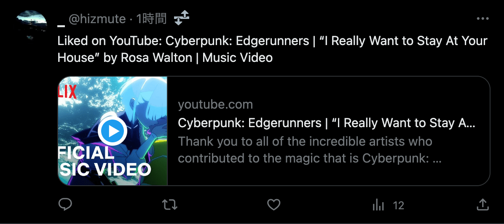

# liked-on-youtube

Post "Liked on YouTube: ..." to X.

[](https://twitter.com/hizmute/status/1708322154188542070)

## Install

**NOTE: Google Apps Script must be run with the same Google account as YouTube's**

### 1. Apply for a twitter developer account

[Authentication](https://developer.twitter.com/en/docs/authentication/oauth-2-0) is required to tweet from third party clients.

1. Apply for a developer account from [here](https://developer.twitter.com/en/apply-for-access)
2. [Create a project and app](https://developer.twitter.com/en/portal/apps/new)
3. Set up "User authentication settings"  
The "Callback URI" will be set later, so any URL is fine.
3. Note down "Client ID" and "Client Secret"

### 2. Enable the Google Apps Script API

Go to https://script.google.com/home/usersettings and turn "On" the toggle.

### 3. Push application code to Google Apps Script

```sh
$ git clone https://github.com/ahuglajbclajep/liked-on-youtube.git .
$ npm i
$ npx clasp login # Use the same account as in step 2

# Replace "YOUR_*" with the ID and Secret you note down in step 1
$ sed -ie s/X_CLIENT_ID/YOUR_X_CLIENT_ID/ src/post.ts
$ sed -ie s/X_CLIENT_SECRET/YOUR_X_CLIENT_SECRET/ src/post.ts
$ npm run deploy
```

### 4. Connect your application to your X account

1. Open the Google Apps Script project page  
e.g. `npx clasp open`
2. Create a new [deployment](https://developers.google.com/apps-script/concepts/deployments) as a Web app (for everyone)
3. Note down the Web app URL
4. Replace the "Callback URI" set in step 1 with the Web app URL
5. Open your browser in incognito mode and log in to X
6. Open another tab in the browser in **incognito mode** and access the Web app URL
7. If all goes well, the connection to X is complete  
Once connected, the application will work even if you archive deployments.

### 5. Start scheduled execution

1. Open the Google Apps Script project page
2. Open index.gs and run the "main" function
3. If there is an update, videos will be posted to X every hour.

## License

[MIT](LICENSE)
